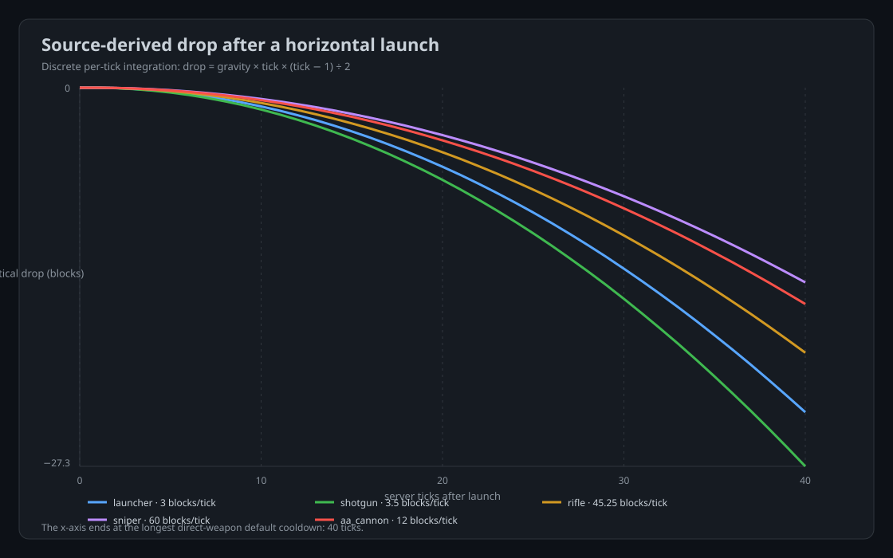
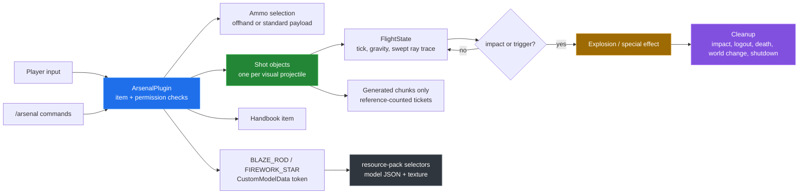
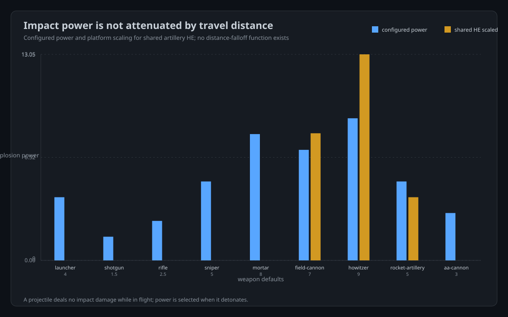

# BKK Arsenal

BKK Arsenal is a Paper weapons plugin that gives players named weapons,
source-selected ammunition, server-side projectiles, and artillery effects in
one runtime. It exists to keep item identity, ballistics, collision, effects,
permissions, and cleanup in one authoritative system instead of splitting them
across launcher and mortar plugins.



The chart is a source-derived horizontal-launch reference. It shows the
discrete gravity integration used by the projectile tick, not a recording from
inside Minecraft.

## Quick start

The repository can be built and tested without a running server:

```sh
mvn verify
python3 tools/catalogue.py
python3 tools/ballistics.py
(cd resource-pack && zip -qr ../target/BKKArsenal-resource-pack-1.1.0.zip pack.mcmeta assets)
```

The first command produces `target/BKKArsenal-1.1.0.jar` and runs the unit
tests. The other commands refresh the source-derived reference, refresh the
SVG charts, and package the resource pack. Running the plugin itself requires a
Paper server; an in-game launch was not available for this documentation pass.

The project targets Paper 1.21.11 and Java 21. The live server should be stopped cleanly before replacing its plugins. Install only `BKKArsenal-1.1.0.jar`; do not run the retired launcher or mortar plugins beside it.

## Architecture



## Capability overview

| Capability | Implementation | Where to read more |
|---|---|---|
| Direct fire | Right-click fires in the look direction. | [Ballistics](docs/ballistics.md) |
| Indirect fire | Right-click locks a block/entity target; left-click releases an arc. | [Ballistics](docs/ballistics.md) |
| Ammunition | Offhand custom rounds override the standard payload when compatible. | [Weapons and ammunition](docs/items-and-ammunition.md) |
| Collision | Each movement segment uses swept block/entity ray tracing. | [Ballistics](docs/ballistics.md) |
| Chunk handling | Existing chunks are ticketed while a segment crosses them; terrain is not generated. | [Ballistics](docs/ballistics.md) |
| Effects | Penetration, airburst, cluster, smoke, illumination, incendiary, marker, disruption, sticky, depth charge, and shatter paths are payload-specific. | [Ballistics](docs/ballistics.md) |
| Player feedback | Native blaze-rod cooldown plus an action-bar seconds/bar indicator. | [Commands and handbook](docs/commands-and-handbook.md) |
| Documentation | Printable `HANDBOOK.md` and in-game `/arsenal handbook` item. | [Commands and handbook](docs/commands-and-handbook.md) |
| Visual identity | Vanilla base items route through the `arsenal` namespace resource pack. | [Resource pack](docs/resource-pack.md) |

## Weapons

| ID | Controls | Role |
| --- | --- | --- |
| `launcher` | Right-click | Fast direct launcher |
| `shotgun` | Right-click | Seven-projectile close-range spread |
| `rifle` | Right-click | Very fast direct rifle |
| `sniper` | Right-click | Long-range precision weapon |
| `mortar` | Right-click target, left-click fire | High-angle indirect fire |
| `field_cannon` | Right-click target, left-click fire | Lower arc heavy artillery |
| `howitzer` | Right-click target, left-click fire | High-angle heavy artillery |
| `rocket_artillery` | Right-click target, left-click fire | Indirect salvo launcher |
| `aa_cannon` | Right-click | Fast proximity/airburst cannon |

All weapons use the same projectile lifecycle, swept collision, chunk-ticket handling, cooldowns, ammunition selection, and permission model. Standard rounds use plain TNT as the fallback; custom ammunition is selected from the offhand.

After firing, the blaze-rod hotbar slot shows Minecraft's native cooldown overlay and the action bar displays a live seconds-remaining countdown with a progress bar.

## Ammunition categories

The system includes platform-specific ammo categories plus a universal category. Every round is labeled with its category in-game, and compatibility is explicit, so shared rounds can still be used by every weapon for which they make sense.

- Universal: `entity_round`
- Launcher: `he_rocket`, `demolition`, `sticky`
- Shotgun: `buckshot`, `breaching`, `slug`, `incendiary_shot`
- Rifle: `standard`, `armor_piercing`, `tracer`, `disruptor`
- Sniper: `precision`, `anti_materiel`, `marker`, `shatter`
- Mortar: `he`, `penetrating`, `depth_charge`, `airburst`, `cluster`, `incendiary_grenade`, `smoke`, `illumination`
- Artillery: `artillery_he`, `artillery_ap`, `artillery_smoke`, `artillery_illumination`, `rocket_salvo`, `incendiary_shell`, `aa_proximity`

Every platform accepts the universal `entity_round`. It damages only the living entity it hits, ignores passable foliage such as grass and vines, never creates an explosion, and never changes blocks. Damage scales with the firing platform; the sniper profile is lethal to ordinary entities.

Use `/arsenal ammo <player> list` to print all categories. Use `/arsenal ammo <player> list <category-or-weapon>` to filter the list, or use a weapon-qualified grant such as `/arsenal ammo Bissbert mortar depth_charge 4`. The weapon-qualified form rejects incompatible ammunition before it is issued. Short form `/arsenal ammo <player> <munition> [amount]` remains available.

Mortar and artillery shells support target-lock arcs, penetration, delayed depth charges, airbursts, cluster strikes, dense volumetric smoke, illumination lights, markers, redstone disruption, incendiary fire, and reduced-terrain incendiary craters.

Impact is platform-specific: mortars use the baseline shell power, field cannons are stronger, howitzers are the heaviest single-shot platform, rocket artillery trades individual impact for a larger salvo, and anti-air shells use a smaller proximity blast. Shared artillery ammunition keeps these platform-specific scaling rules.

## Commands

```text
/arsenal give <player> [weapon] [amount]
/arsenal ammo <player> <munition> [amount]
/arsenal cooldown [weapon] <seconds>
/arsenal reload
/arsenal status
/arsenal handbook [player]
```

Permissions:

- `arsenal.use` — use weapons (everyone by default)
- `arsenal.admin` — issue weapons/ammunition and reload settings (operators by default)
- `arsenal.infiniteammo` — bypass survival ammunition consumption (disabled by default)
- `arsenal.handbook` — receive the in-game handbook (everyone by default)

There is deliberately no compatibility layer for the retired plugins. Existing items from those plugins are not recognized; issue new Arsenal items after installation.

## Projectile and world behavior

Projectiles are logical server-side objects. BlockDisplay entities are visuals only and may disappear without ending the shot. Collision is swept across every movement segment, including high-speed rounds and entities. Projectiles do not have artificial distance or lifetime expiry and may travel above the build ceiling before descending.

Only already-generated chunks are ticketed; the plugin does not generate terrain. Chunk leases are reference-counted across simultaneous shots. Player death, disconnect, world changes, world unloads, and plugin shutdown clean up owned projectiles and temporary effects.

Smoke is emitted as a layered, drifting three-dimensional particle volume. Incendiaries preserve full entity damage radius while using a small terrain crater and a larger persistent fire patch. Temporary illumination lights share ownership and restore their original blocks.

## Measured results



The repository-side checks produced these results:

| Check | Result |
|---|---|
| `mvn verify` | Build success; three `FlightStateTest` tests passed. |
| Source catalogue | Six categories, nine weapons, thirty ammunition types, fourteen tunable defaults, and seventy-one shipped config keys. |
| Ballistics charts | Five direct weapons plotted through forty ticks; the maximum plotted drop is 27.300 blocks. |
| Resource-pack audit | Forty-six textures, thirty-nine models, thirty-nine selector cases; every texture is 16×16, 8-bit PNG color type 6 (RGBA). |
| Resource-pack token audit | Seven shared artillery model tokens were missing from the firework-star selector at the time of this pass; they have since been mapped on the default branch. |
| In-game capture | Not measured: it requires a running Paper server and a Minecraft client. |

The exact commands, raw outputs, derived-chart formulas, and the known pack
audit failure are recorded in [docs/measurement.md](docs/measurement.md).

## Handbook

`HANDBOOK.md` is the printable reference. Players can receive the same guide in-game with `/arsenal handbook`; it contains controls, weapon platforms, category-specific ammunition pages, lookup commands, and effect notes.

## Resource pack

The pack contains distinct 16×16 vanilla-style sprites and models under the `arsenal` namespace for every weapon and ammunition type. The live server requires this pack so clients cannot silently use identical vanilla sprites; standalone plugin operation without the pack still falls back to named blaze rods and firework stars. The merged server archive preserves Dungeons & Taverns and has no dependency on retired namespaces.

Build it with:

```sh
zip -r target/BKKArsenal-resource-pack-1.1.0.zip pack.mcmeta assets
```

## Repository layout

| Path | Purpose |
|---|---|
| `src/main/java/` | Plugin runtime and the one-shot `FlightState` gate. |
| `src/main/resources/` | `plugin.yml` permissions/command metadata and `config.yml` defaults. |
| `src/test/java/` | Unit tests for terminal projectile state behavior. |
| `HANDBOOK.md` | Printable field reference maintained alongside the plugin. |
| `resource-pack/` | Item selectors, model JSON, and `arsenal` textures. |
| `art-generated/` | Existing weapon and ammunition art sheets. |
| `tools/` | Source parser, catalogue generator, chart generator, and pack audit. |
| `media/` | Source-derived SVG charts used by the README and ballistics write-up. |
| `docs/` | Subsystem write-ups and measurement provenance. |

## Known limitations

- The plugin was not exercised in a live Paper server during this pass. The
  build and unit tests pass, but target locking, collision, effects, permissions,
  cooldown UI, and cleanup still need an in-game run.
- Damage has no distance-falloff function. A projectile does not deal damage in
  flight; when a collision or trigger calls `detonate`, payload and platform
  constants choose the impact power. The impact chart makes that absence
  explicit.
- The seven shared artillery rounds originally shipped `arsenal:shell_*`
  custom-model tokens that `firework_star.json` did not select, so they fell
  back to the vanilla firework-star model. The selector cases have since been
  added on the default branch; the original reproduction is kept in
  [BUGS-FOUND](docs/BUGS-FOUND.md) for provenance.
- `HANDBOOK.md` and the in-game handbook describe the same feature set but are
  separate texts. They are not generated from one shared source and can drift.
- There is no real-run GIF in this pass. Capturing one honestly requires a
  running server and client, so the deliverable uses diagrams and source-derived
  charts only.
