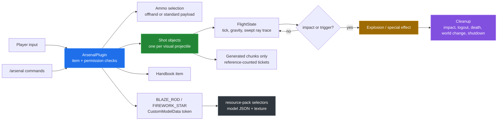

# BKK Arsenal

BKK Arsenal is a Paper weapons plugin that gives players named weapons,
source-selected ammunition, server-side projectiles, and artillery effects in
one runtime. It exists to keep item identity, ballistics, collision, effects,
permissions, and cleanup in one authoritative system instead of splitting them
across launcher and mortar plugins.


The chart is a source-derived horizontal-launch reference. It shows the
discrete gravity integration used by the projectile tick, not a recording from
inside Minecraft.

## Quick start

The repository can be built and tested without a running server:

```sh
mvn verify
python3 tools/catalogue.py
python3 tools/ballistics.py
(cd resource-pack && zip -qr ../target/BKKArsenal-resource-pack-1.1.0.zip pack.mcmeta assets)
```

The first command produces `target/BKKArsenal-1.1.0.jar` and runs the unit
tests. The other commands refresh the source-derived reference, refresh the
SVG charts, and package the resource pack. Running the plugin itself requires a
Paper server; an in-game launch was not available for this documentation pass.

## Architecture



## Capability overview

| Capability | Implementation | Where to read more |
|---|---|---|
| Direct fire | Right-click fires in the look direction. | [Ballistics](docs/ballistics.md) |
| Indirect fire | Right-click locks a block/entity target; left-click releases an arc. | [Ballistics](docs/ballistics.md) |
| Ammunition | Offhand custom rounds override the standard payload when compatible. | [Weapons and ammunition](docs/items-and-ammunition.md) |
| Collision | Each movement segment uses swept block/entity ray tracing. | [Ballistics](docs/ballistics.md) |
| Chunk handling | Existing chunks are ticketed while a segment crosses them; terrain is not generated. | [Ballistics](docs/ballistics.md) |
| Effects | Penetration, airburst, cluster, smoke, illumination, incendiary, marker, disruption, sticky, depth charge, and shatter paths are payload-specific. | [Ballistics](docs/ballistics.md) |
| Player feedback | Native blaze-rod cooldown plus an action-bar seconds/bar indicator. | [Commands and handbook](docs/commands-and-handbook.md) |
| Documentation | Printable `HANDBOOK.md` and in-game `/arsenal handbook` item. | [Commands and handbook](docs/commands-and-handbook.md) |
| Visual identity | Vanilla base items route through the `arsenal` namespace resource pack. | [Resource pack](docs/resource-pack.md) |

## Measured results


The repository-side checks produced these results:

| Check | Result |
|---|---|
| `mvn verify` | Build success; three `FlightStateTest` tests passed. |
| Source catalogue | Six categories, nine weapons, thirty ammunition types, fourteen tunable defaults, and seventy-one shipped config keys. |
| Ballistics charts | Five direct weapons plotted through forty ticks; the maximum plotted drop is 27.300 blocks. |
| Resource-pack audit | Forty-six textures, thirty-nine models, thirty-nine selector cases; every texture is 16×16, 8-bit PNG color type 6 (RGBA). |
| Resource-pack token audit | Seven source model tokens are not present in the firework-star selector; see [the limitation](docs/resource-pack.md#current-audit). |
| In-game capture | Not measured: it requires a running Paper server and a Minecraft client. |

The exact commands, raw outputs, derived-chart formulas, and the known pack
audit failure are recorded in [docs/measurement.md](docs/measurement.md).

## Repository layout

| Path | Purpose |
|---|---|
| `src/main/java/` | Plugin runtime and the one-shot `FlightState` gate. |
| `src/main/resources/` | `plugin.yml` permissions/command metadata and `config.yml` defaults. |
| `src/test/java/` | Unit tests for terminal projectile state behavior. |
| `HANDBOOK.md` | Printable field reference maintained alongside the plugin. |
| `resource-pack/` | Item selectors, model JSON, and `arsenal` textures. |
| `art-generated/` | Existing weapon and ammunition art sheets. |
| `tools/` | Source parser, catalogue generator, chart generator, and pack audit. |
| `media/` | Source-derived SVG charts used by the README and ballistics write-up. |
| `docs/` | Subsystem write-ups and measurement provenance. |

## Known limitations

- The plugin was not exercised in a live Paper server during this pass. The
  build and unit tests pass, but target locking, collision, effects, permissions,
  cooldown UI, and cleanup still need an in-game run.
- Damage has no distance-falloff function. A projectile does not deal damage in
  flight; when a collision or trigger calls `detonate`, payload and platform
  constants choose the impact power. The impact chart makes that absence
  explicit.
- The source uses `arsenal:shell_*` custom-model tokens for seven shared
  artillery rounds, while `firework_star.json` contains `arsenal:artillery_*`
  selector cases. The pack audit flags those seven mismatches; they may fall
  back to the vanilla firework-star model until the tokens are reconciled. The
  exact reproduction and an unapplied fix are in [BUGS-FOUND](docs/BUGS-FOUND.md).
- `HANDBOOK.md` and the in-game handbook describe the same feature set but are
  separate texts. They are not generated from one shared source and can drift.
- There is no real-run GIF in this pass. Capturing one honestly requires a
  running server and client, so the deliverable uses diagrams and source-derived
  charts only.
