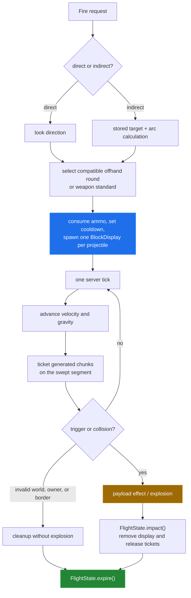
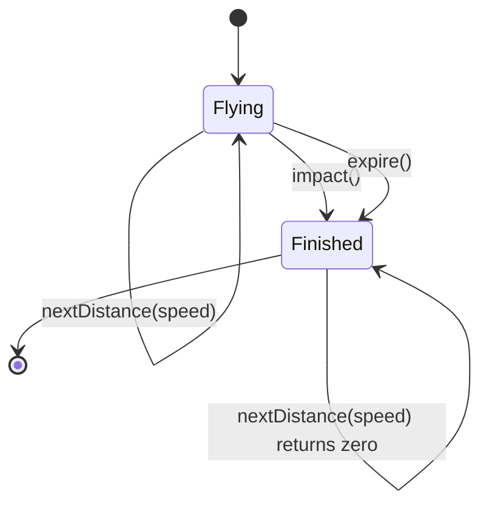

# Projectile flight and effects

[← back to the overview](../README.md)

The projectile runtime is in `ArsenalPlugin.Shot`. A shot owns its visual
`BlockDisplay`, velocity, selected payload, platform settings, chunk tickets,
and one-shot `FlightState`. The display is only a visual handle; the shot state
is what determines whether flight continues or an impact can happen.

## From input to impact

Direct weapons use the player's normalized look vector. Indirect weapons first
ray-trace a target, then calculate an arc with a clearance selected by platform.
The launch code uses the plugin's discrete per-tick gravity integration, so the
vertical displacement after `t` ticks is `v₀t − gravity × t × (t − 1) / 2`.

This chart is generated by `tools/ballistics.py` from the default speed and
gravity values in `config.yml`. It plots five direct weapons through the longest
direct-weapon default cooldown found in the source. It is a reference curve for
a horizontal launch; player aim, blocks, entities, and world borders are not
simulated.

## Terminal state and cleanup

`FlightState` is deliberately small:

The impact gate is shared by collision and cleanup paths. A shot can therefore
be removed by an impact, owner death/disconnect/world change, world unload, a
plugin disable, or a failed tick without later creating a second explosion.
There is no distance or lifetime expiry in `FlightState`; a shot only stops
when its owner/world is invalid, it leaves the world border or minimum height,
an already-generated chunk cannot be held, or a payload reaches its trigger.

Chunk tickets are reference-counted per world/chunk pair. A shot claims the
already-generated chunks touched by its swept segment and releases old claims as
it moves. It never asks the server to generate terrain. The configured active
projectile ceiling is 100 shots, checked before a fire request is accepted.

## Collision and trigger order

Each tick checks the next movement segment before moving the display. Block and
entity ray tracing uses the full segment, including fast rounds. Triggered
payloads can detonate before a normal hit:

| Payload family | Trigger in the runtime |
|---|---|
| Airburst and anti-air proximity | Descending terrain check; anti-air also checks nearby eligible targets. |
| Cluster and rocket salvo | Descending terrain check, then eight delayed secondary explosions. |
| Illumination | Descending terrain check, then temporary marker and shared light blocks. |
| Sticky | First block hit arms a 40-tick fuse instead of exploding immediately. |
| Depth charge | First block hit schedules four delayed blasts with increasing depth. |
| Everything else | Swept block/entity hit, followed by the payload-specific impact branch. |

The numeric trigger values and effect schedules in that table come directly from
`ArsenalPlugin.java`; they are not observations from a live server.

## Impact power is not distance falloff

The source has no damage-vs-distance function. `Shot.advance()` uses distance
to move and collision-test the projectile; `Shot.detonate()` chooses power from
the payload and platform. The chart therefore compares configured power and
shared artillery-HE platform scaling. It is not a blast-radius benchmark and it
does not claim that an explosion reaches a particular number of blocks.

The practical consequences are:

- Direct rounds keep their configured impact power until a collision.
- Shared artillery HE scales with the firing platform: field cannon, howitzer,
  and rocket artillery use their source-defined platform factors.
- Incendiaries preserve their entity explosion path, then add a smaller terrain
  scorch radius and a larger fire radius.
- Penetrating, shatter, cluster, smoke, illumination, marker, redstone
  disruption, and depth-charge rounds branch into distinct effect code rather
  than a distance curve.

## What remains unverified

No server/client run was available for this pass. The diagrams describe the
control flow and the charts are derived from checked-in source/config values;
they do not verify Paper event ordering, world physics, client rendering,
explosion resistance, or permission-provider behavior.

[← back to the overview](../README.md)
