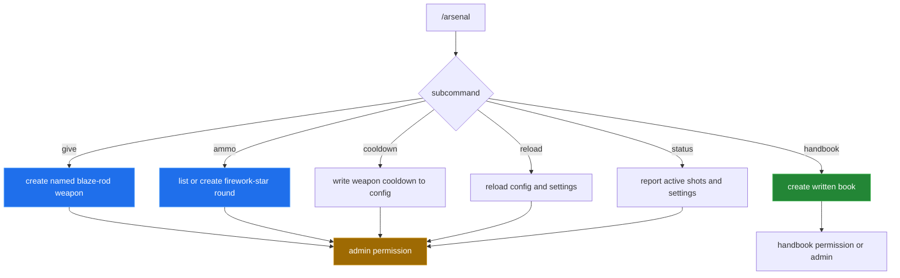

# Commands and handbook

[← back to the overview](../README.md)

`ArsenalPlugin` implements `TabExecutor`, so command parsing and tab completion
live beside the item and projectile runtime. All administrative subcommands are
guarded by `arsenal.admin`; the handbook has its own player-facing permission.

## Command flow

## Command surface

| Command | Purpose | Permission | Constraints from source |
|---|---|---|---|
| `/arsenal` | Give the sender one launcher when the sender is a player. | `arsenal.admin` | Console must use an explicit player form. |
| `/arsenal give <player> [weapon] [amount]` | Give named blaze-rod weapons. | `arsenal.admin` | Amount is 1–16; weapon IDs accept hyphens or underscores. |
| `/arsenal ammo <player> list [category-or-weapon]` | List all rounds, a category, or compatible rounds for one weapon. | `arsenal.admin` | Category and weapon scopes are tab-completed. |
| `/arsenal ammo <player> <munition> [amount]` | Give an unqualified custom round. | `arsenal.admin` | Amount is 1–64. |
| `/arsenal ammo <player> <weapon> <munition> [amount]` | Give a round after checking weapon compatibility. | `arsenal.admin` | Incompatible rounds are rejected before issue. |
| `/arsenal cooldown [weapon] <seconds>` | Persist and immediately apply one weapon's cooldown. | `arsenal.admin` | Accepted range is 0.05–60 seconds; the value is rounded to ticks. |
| `/arsenal reload` | Reload `config.yml` and rebuild settings. | `arsenal.admin` | Existing shots are not described as restarted by the command. |
| `/arsenal status` | Print active-shot count, global settings, and weapon defaults. | `arsenal.admin` | Reports current in-memory settings. |
| `/arsenal handbook [player]` | Give the sender or a named online player the book. | `arsenal.handbook` or `arsenal.admin` | Giving it to another player requires admin. |

The usage string in `plugin.yml` is the command metadata; the table above
follows the actual branches in `onCommand`, including the sender-only shorthand.

## Permissions

| Permission | Default | Effect |
|---|---|---|
| `arsenal.use` | true | Allows a player to fire. |
| `arsenal.admin` | op | Allows weapon/ammunition issue, reload, cooldown, status, and admin handbook delivery. |
| `arsenal.infiniteammo` | false | Skips survival ammunition consumption. Creative players also do not consume ammo. |
| `arsenal.handbook` | true | Allows a player to receive the handbook for themself. |

## Item and ammo selection

Weapons are named `BLAZE_ROD` items carrying a persistent `gun` ID and a custom
model token. Custom rounds are `FIREWORK_STAR` items carrying a persistent
`grenade` ID. Holding a compatible round in the offhand selects it; an empty or
incompatible offhand falls back to the weapon's standard payload or rejects the
fire request as appropriate. The complete source-derived mapping is in
[Weapons and ammunition](items-and-ammunition.md).

After a successful fire, the plugin sets the native blaze-rod cooldown and also
updates an action-bar countdown each server tick. Demolition rounds double the
selected weapon cooldown. This UI path was read from source but not observed in
a live client.

## Printable and in-game handbook

`HANDBOOK.md` is the human-maintained printable field reference. It expands the
controls, platform roles, source-derived ammunition catalogue, lookup examples,
effects, and graphics contract.

`/arsenal handbook` creates a separate `WRITTEN_BOOK` at runtime. Its pages are
assembled in `ArsenalPlugin.handbook()` from the same conceptual areas: controls,
platforms, one page per ammo category, lookup syntax, and field notes. The two
references are related but are not byte-for-byte copies and are not generated
from a shared data file. Changes to a weapon or round should therefore be
checked against both.

[← back to the overview](../README.md)
