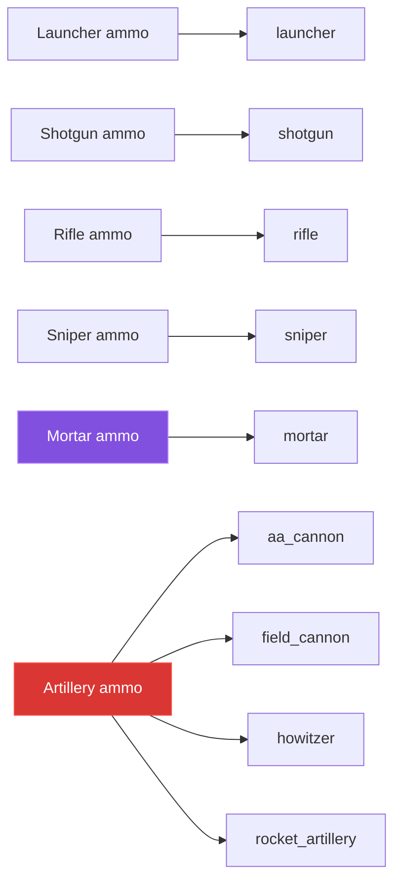

# Weapons and ammunition

[← back to the overview](../README.md)

This reference is source-derived. Run `python3 tools/catalogue.py` after changing
the weapon enums or their defaults; the tables below are not maintained by hand.

## Weapon reference

The speed and gravity columns use the units in `config.yml`: blocks per tick and
blocks per tick squared. Cooldowns are also source values in ticks; the seconds
value is the direct conversion using the server's twenty ticks per second.

| ID | Mode | Speed | Gravity | Power | Cooldown | Projectiles | Spread | Standard ammo |
|---|---|---:|---:|---:|---:|---:|---:|---|
| `launcher` | direct | 3 | 0.03 | 4 | 30 (1.5s) | 1 | 0° | `he_rocket` |
| `shotgun` | direct | 3.5 | 0.035 | 1.5 | 20 (1s) | 7 | 7° | `buckshot` |
| `rifle` | direct | 45.25 | 0.0245 | 2.5 | 3 (0.15s) | 1 | 0° | `standard` |
| `sniper` | direct | 60 | 0.018 | 5 | 40 (2s) | 1 | 0° | `precision` |
| `mortar` | indirect | 2 | 0.01 | 8 | 100 (5s) | 1 | 0° | `he` |
| `field_cannon` | indirect | 3 | 0.012 | 7 | 60 (3s) | 1 | 0° | `artillery_he` |
| `howitzer` | indirect | 2.2 | 0.01 | 9 | 100 (5s) | 1 | 0° | `artillery_he` |
| `rocket_artillery` | indirect | 2.8 | 0.015 | 5 | 160 (8s) | 6 | 5° | `rocket_salvo` |
| `aa_cannon` | direct | 12 | 0.02 | 3 | 8 (0.4s) | 1 | 0° | `aa_proximity` |

`projectiles` and `spread` are the configured defaults. Payloads can override
these for the slug and breaching rounds, and demolition doubles the selected
weapon's cooldown at fire time.

## Ammunition reference

Compatibility is read from each `MunitionType` declaration. `yes` means that the
round is the platform's default payload when the offhand is empty.

| ID | Display title | Category | Compatible weapons | Standard | Model token |
|---|---|---|---|---|---|
| `he_rocket` | HE Rocket | launcher | `launcher` | yes | `arsenal:he_rocket` |
| `demolition` | Demolition Rocket | launcher | `launcher` | no | `arsenal:demolition` |
| `sticky` | Sticky Charge | launcher | `launcher` | no | `arsenal:sticky` |
| `buckshot` | Buckshot | shotgun | `shotgun` | yes | `arsenal:buckshot` |
| `breaching` | Breaching Shell | shotgun | `shotgun` | no | `arsenal:breaching` |
| `slug` | Explosive Slug | shotgun | `shotgun` | no | `arsenal:slug` |
| `incendiary_shot` | Incendiary Shot | shotgun | `shotgun` | no | `arsenal:incendiary_shot` |
| `standard` | Standard Rifle Round | rifle | `rifle` | yes | `arsenal:standard` |
| `armor_piercing` | Armor-Piercing Rifle Round | rifle | `rifle` | no | `arsenal:armor_piercing` |
| `tracer` | Tracer Round | rifle | `rifle` | no | `arsenal:tracer` |
| `disruptor` | Redstone Disruptor | rifle | `rifle` | no | `arsenal:disruptor` |
| `precision` | Precision Sniper Round | sniper | `sniper` | yes | `arsenal:precision` |
| `anti_materiel` | Anti-Materiel Round | sniper | `sniper` | no | `arsenal:anti_materiel` |
| `marker` | Target Marker Round | sniper | `sniper` | no | `arsenal:marker` |
| `shatter` | Shatter Round | sniper | `sniper` | no | `arsenal:shatter` |
| `he` | HE Mortar Grenade | mortar | `mortar` | yes | `arsenal:he` |
| `penetrating` | Penetrating Mortar Grenade | mortar | `mortar` | no | `arsenal:penetrating` |
| `depth_charge` | THE DEPTH CHARGE | mortar | `mortar` | no | `arsenal:depth_charge` |
| `airburst` | Airburst Mortar Grenade | mortar | `mortar` | no | `arsenal:airburst` |
| `cluster` | Cluster Mortar Grenade | mortar | `mortar` | no | `arsenal:cluster` |
| `incendiary_grenade` | Incendiary Mortar Grenade | mortar | `mortar` | no | `arsenal:incendiary_grenade` |
| `smoke` | Smoke Mortar Grenade | mortar | `mortar` | no | `arsenal:smoke` |
| `illumination` | Illumination Flare | mortar | `mortar` | no | `arsenal:illumination` |
| `artillery_he` | Artillery HE Shell | artillery | `field_cannon`, `howitzer`, `rocket_artillery` | yes | `arsenal:shell_he` |
| `artillery_ap` | Artillery AP Shell | artillery | `field_cannon`, `howitzer` | no | `arsenal:shell_ap` |
| `artillery_smoke` | Artillery Smoke Shell | artillery | `field_cannon`, `howitzer`, `rocket_artillery` | no | `arsenal:shell_smoke` |
| `artillery_illumination` | Artillery Illumination Shell | artillery | `field_cannon`, `howitzer` | no | `arsenal:shell_flare` |
| `rocket_salvo` | Rocket Salvo | artillery | `rocket_artillery` | yes | `arsenal:shell_cluster` |
| `incendiary_shell` | Incendiary Artillery Shell | artillery | `field_cannon`, `howitzer`, `rocket_artillery` | no | `arsenal:shell_incendiary` |
| `aa_proximity` | Proximity Anti-Air Shell | artillery | `aa_cannon` | yes | `arsenal:shell_airburst` |

## Other source values

The parser currently sees 6 ammo categories, 9 weapons,
30 ammunition types, 14 tunable defaults, and
71 shipped config keys. These counts are emitted by the generator and
are covered by the provenance notes in [measurement](measurement.md).

## Runtime effect notes

The table above intentionally reports identifiers and constants, not guessed
descriptions. The runtime maps those identifiers to behavior in
`ArsenalPlugin.Shot`: penetration, airburst, cluster, smoke, illumination,
incendiary, marker, redstone disruption, sticky fuse, depth charge, and shatter
branches are documented in [ballistics](ballistics.md).

[← back to the overview](../README.md)
