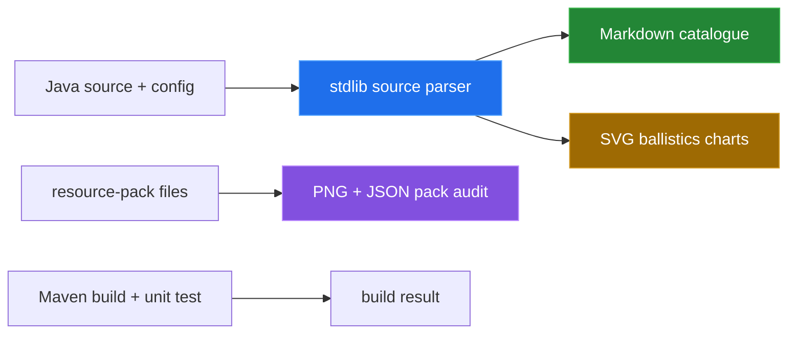

# How this was measured

[← back to the overview](../README.md)

Every number in the documentation pass comes from a command run against this
checkout, or is a value parsed from source by a committed tool and printed by
that tool. No in-game output was staged or presented as a recording.



## Source extraction

The `tools/arsenal_source.py` parser reads the weapon, ammunition,
and settings declarations from `ArsenalPlugin.java` and the shipped defaults
from `config.yml`. `tools/catalogue.py` imports it and writes
`docs/items-and-ammunition.md`.

Command:

```sh
python3 tools/catalogue.py
```

Observed output:

```text
source counts: categories=6 weapons=9 munitions=30 tuning_keys=14 config_keys=71
wrote docs/items-and-ammunition.md
```

The generated weapon table reports speed in blocks/tick, gravity in
blocks/tick², cooldown in source ticks plus its conversion using the 20 ticks
per second unit documented in `config.yml`. The ammunition table reports enum
IDs, display titles, categories, compatibility, standard-payload status, and
the model token exactly as parsed.

## Derived charts

`tools/ballistics.py` uses only the parsed weapon defaults and writes the two
SVG files in `media/`.

Command:

```sh
python3 tools/ballistics.py
```

Observed output:

```text
trajectory: direct_weapons=5 max_ticks=40 max_drop=27.300 blocks
impact model: weapons=9 chart_max=13.050 power
wrote media/trajectory.svg and media/impact-model.svg
```

The trajectory plot applies the same discrete update order visible in `Shot`:
move by the current velocity, then subtract gravity from the vertical velocity.
For a horizontal launch, the plotted drop after `t` ticks is
`gravity × t × (t − 1) / 2`. The chart span is derived from the longest direct
weapon cooldown in the parsed defaults; it is not a range limit.

The impact chart compares configured weapon power with shared artillery-HE
platform scaling. It intentionally does not plot damage over distance because
the source has no distance-falloff function. The runtime only selects impact
power when a trigger calls `detonate`.

## Resource-pack audit

`tools/packcheck.py` parses PNG headers with `struct`, reads selector/model JSON
with `json`, and compares those files with the same source parser.

Command:

```sh
python3 tools/packcheck.py
```

Observed output:

```text
pack files: textures=46 models=39 selector_cases=39
shell texture files: 7
texture format: 16x16/8bit/color_type_6
non-16x16 RGBA textures: none
selector cases missing source IDs: none
selector cases not in source IDs: none
source model tokens not in selector cases: shell_airburst, shell_ap, shell_cluster, shell_flare, shell_he, shell_incendiary, shell_smoke
selector target model files missing: none
```

The command exits nonzero because the seven source model-token mismatches are
real findings. They are documented in [resource-pack](resource-pack.md).

## Build and package checks

The Java toolchain was queried with `java -version` and `mvn -version`. The
reported runtime was OpenJDK 21.0.2 and Maven 3.9.11 on this machine.

Command:

```sh
mvn verify
```

Observed result: `BUILD SUCCESS`; `FlightStateTest` ran 3 tests with 0 failures,
0 errors, and 0 skipped. This verifies compilation and the checked-in unit
test, not a live Paper server.

The resource pack was then built with:

```sh
(cd resource-pack && zip -qr ../target/BKKArsenal-resource-pack-1.1.0.zip pack.mcmeta assets)
unzip -l target/BKKArsenal-resource-pack-1.1.0.zip | tail -n 4
stat -f '%z bytes' target/BKKArsenal-resource-pack-1.1.0.zip
```

The observed archive summary was 96 entries and `41674 bytes`.

## Not measured

No real in-game GIF or server/client capture was produced. A Paper server and a
Minecraft client are required to observe target locking, projectile collision,
world effects, cooldown rendering, resource-pack rendering, and cleanup across
player/world events. The charts in this repository are source-derived diagrams,
not recordings.

[← back to the overview](../README.md)
