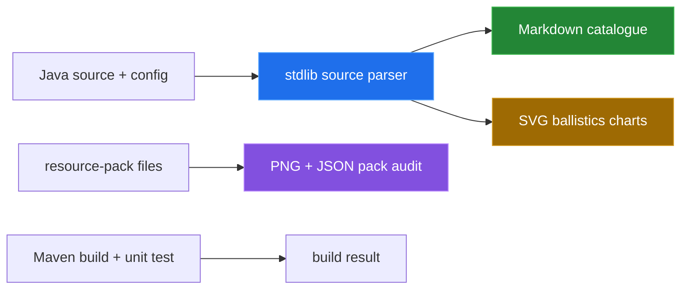

# How this was measured

[← back to the overview](../README.md)

Every number in the documentation comes from a command run in a Linux
container, or is a value parsed from source by a committed tool and printed by
that tool. No in-game output was staged or presented as a recording.

One script runs all of it:

```sh
sh tools/linux-run.sh > media/captures/linux-run.txt
```

It starts `maven:3.9-eclipse-temurin-21`, adds `python3` and `zip`, copies the
read-only mounted repository, and runs each command below. The output quoted on
this page is from [`media/captures/linux-run.txt`](../media/captures/linux-run.txt).



## Source extraction

The `tools/arsenal_source.py` parser reads the weapon, ammunition,
and settings declarations from `ArsenalPlugin.java` and the shipped defaults
from `config.yml`. `tools/catalogue.py` imports it and writes
`docs/items-and-ammunition.md`.

Command:

```sh
python3 tools/catalogue.py
```

Observed output:

```text
source counts: categories=7 weapons=9 munitions=31 tuning_keys=14 config_keys=71
wrote docs/items-and-ammunition.md
docs/items-and-ammunition.md unchanged
```

The generated weapon table reports speed in blocks/tick, gravity in
blocks/tick², cooldown in source ticks plus its conversion using the 20 ticks
per second unit documented in `config.yml`. The ammunition table reports enum
IDs, display titles, categories, compatibility, standard-payload status, and
the model token exactly as parsed. The category follows
`MunitionType.category()`, so `entity_round` is filed under Universal rather
than under its primary weapon. "unchanged" means the regenerated file matches
the committed one.

## Derived charts

`tools/ballistics.py` uses only the parsed weapon defaults and writes the two
SVG files in `media/`.

Command:

```sh
python3 tools/ballistics.py
```

Observed output:

```text
trajectory: direct_weapons=5 max_ticks=40 max_drop=27.300 blocks
impact model: weapons=9 chart_max=13.050 power
wrote media/trajectory.svg and media/impact-model.svg
media/trajectory.svg byte-identical
media/impact-model.svg byte-identical
```

The trajectory plot applies the same discrete update order visible in `Shot`:
move by the current velocity, then subtract gravity from the vertical velocity.
For a horizontal launch, the plotted drop after `t` ticks is
`gravity × t × (t − 1) / 2`. The chart span is derived from the longest direct
weapon cooldown in the parsed defaults; it is not a range limit.

The impact chart compares configured weapon power with shared artillery-HE
platform scaling. It intentionally does not plot damage over distance because
the source has no distance-falloff function. The runtime only selects impact
power when a trigger calls `detonate`.

## Resource-pack audit

`tools/packcheck.py` parses PNG headers with `struct`, reads selector/model JSON
with `json`, and compares those files with the same source parser.

Command:

```sh
python3 tools/packcheck.py
```

Observed output:

```text
pack files: textures=47 models=40 selector_cases=47
shell texture files: 7
texture format: 16x16/8bit/color_type_6
non-16x16 RGBA textures: none
selector cases missing source IDs: none
selector cases not in source IDs: none
source model tokens not in selector cases: none
selector target model files missing: none
exit=0
```

Every munition ID and every model token the plugin writes has a selector case.
The command exits nonzero if one goes missing. Before `48eccff` it reported
seven `shell_*` tokens here; see [Bugs found](BUGS-FOUND.md).

## Build and package checks

Command:

```sh
mvn -B -q verify
```

Observed output:

```text
exit=0
Tests run: 3, Failures: 0, Errors: 0, Skipped: 0, Time elapsed: 0.026 s -- in ch.bissbert.arsenal.FlightStateTest
51675 target/BKKArsenal-1.1.0.jar
```

This verifies compilation and the checked-in unit test, not a live Paper
server.

The resource pack was then built with:

```sh
(cd resource-pack && zip -qr ../target/BKKArsenal-resource-pack-1.1.0.zip pack.mcmeta assets)
unzip -l target/BKKArsenal-resource-pack-1.1.0.zip | tail -n 1
stat -c '%s bytes' target/BKKArsenal-resource-pack-1.1.0.zip
```

The archive has 98 entries and is 42,555 bytes.

## Environment

| | |
|---|---|
| Kernel | Linux 6.5.11-linuxkit, aarch64 (Docker Desktop VM) |
| Image | `maven:3.9-eclipse-temurin-21` (`sha256:c2a2c585…`) |
| Java | OpenJDK 21.0.12 |
| Maven | 3.9.16 |
| Python | 3.12.3 |
| Date | 2026-09-24 |

## Not measured

No real in-game GIF or server/client capture was produced. A Paper server and a
Minecraft client are required to observe target locking, projectile collision,
world effects, cooldown rendering, resource-pack rendering, and cleanup across
player/world events. The charts in this repository are source-derived diagrams,
not recordings.

[← back to the overview](../README.md)
