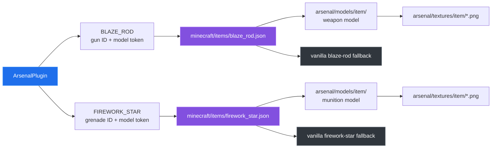

# Resource pack

[← back to the overview](../README.md)

The plugin deliberately keeps the server item types vanilla: weapons are blaze
rods and custom rounds are firework stars. The resource pack turns the
`CustomModelData` strings written by `ArsenalPlugin` into named Arsenal models.

## Rendering path



The plugin and pack must agree on the selector token, not only on the visible
item name. The pack also carries separate selector cases for weapons and
ammunition so an unmarked vanilla item continues to use its normal model.

## Current audit

`python3 tools/packcheck.py` reads PNG headers with the standard library,
enumerates model JSON, and compares source enum IDs/model tokens with both
selector JSON files. The checked-in pack contains:

| Asset or check | Result |
|---|---|
| Item textures | 47 files; all are 16×16, 8-bit PNG color type 6 (RGBA). |
| Item models | 40 JSON files. |
| Selector cases | 47 cases across the blaze-rod and firework-star selectors. |
| Selector target files | No missing model files. |
| Source IDs and model tokens vs selector cases | No missing or extra cases. |

Seven shared artillery rounds write `arsenal:shell_*` model tokens rather than
their munition IDs. The firework-star selector has a case for each spelling:
`arsenal:shell_he` and `arsenal:artillery_he` both resolve to
`arsenal:item/artillery_he`, and likewise for the other six. Keeping the
`shell_*` tokens means items already issued on a server keep their model. The
audit exits nonzero if any token the plugin writes loses its case.

There are also seven `shell_*.png` texture files alongside the 40 textures
named by the weapon and munition IDs. No model references them, so they are
present in the pack but not rendered.

## Packaging

From the repository root:

```sh
(cd resource-pack && zip -qr ../target/BKKArsenal-resource-pack-1.1.0.zip pack.mcmeta assets)
```

In the Linux container this created a 98-entry archive of 42,555 bytes. The
archive can be merged with other packs at the server level.

[← back to the overview](../README.md)
