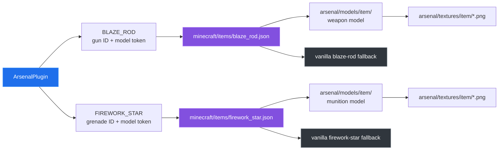

# Resource pack

[← back to the overview](../README.md)

The plugin deliberately keeps the server item types vanilla: weapons are blaze
rods and custom rounds are firework stars. The resource pack turns the
`CustomModelData` strings written by `ArsenalPlugin` into named Arsenal models.

## Rendering path



The plugin and pack must agree on the selector token, not only on the visible
item name. The pack also carries separate selector cases for weapons and
ammunition so an unmarked vanilla item continues to use its normal model.

## Current audit

`python3 tools/packcheck.py` reads PNG headers with the standard library,
enumerates model JSON, and compares source enum IDs/model tokens with both
selector JSON files. The checked-in pack contains:

| Asset or check | Result |
|---|---|
| Item textures | 46 files; all are 16×16, 8-bit PNG color type 6 (RGBA). |
| Item models | 39 JSON files. |
| Selector cases | 39 cases across the blaze-rod and firework-star selectors. |
| Selector target files | No missing model files. |
| Source IDs vs selector cases | No missing or extra IDs. |
| Source model tokens vs firework selector | Seven mismatches: `shell_airburst`, `shell_ap`, `shell_cluster`, `shell_flare`, `shell_he`, `shell_incendiary`, `shell_smoke`. |

The last row is a real source/pack mismatch, not a measurement failure. The
munition enum writes those `arsenal:shell_*` strings, while the selector cases
use `arsenal:aa_proximity`, `arsenal:artillery_ap`, `arsenal:rocket_salvo`, and
the other munition IDs. The audit exits nonzero so a future change can make this
contract fail loudly. This pass does not change runtime behavior.

There are also seven `shell_*.png` texture files alongside the 39 textures
named by the weapon and munition IDs. They are present in the pack but the
current audit does not claim that each one is reachable from a selector case.

## Packaging

From the repository root:

```sh
(cd resource-pack && zip -qr ../target/BKKArsenal-resource-pack-1.1.0.zip pack.mcmeta assets)
```

The verified local packaging command created a 96-entry archive of 41,674
bytes. The archive can be merged with other packs at the server level, but the
selector-token mismatch above should be resolved before treating every custom
round as visually covered.

[← back to the overview](../README.md)
